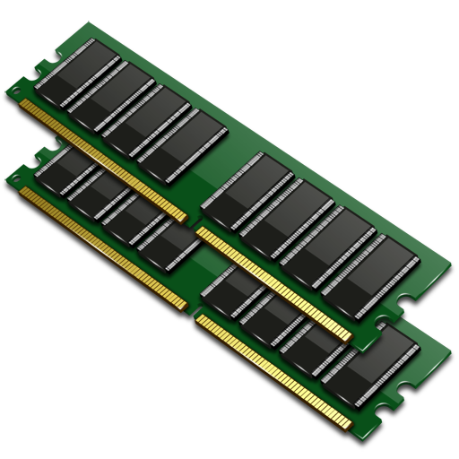

<!--
*** Thanks for checking out this README Template. If you have a suggestion that would
*** make this better, please fork the libhack and create a pull request or simply open
*** an issue with the tag "enhancement".
*** Thanks again! Now go create something AMAZING! :D
***
***
***
*** To avoid retyping too much info. Do a search and replace for the following:
*** lucas-engen, libhack, __lucas.vmx, lucas.engen.cc@gmail.com
-->


<!-- PROJECT SHIELDS -->
<!--
*** I'm using markdown "reference style" links for readability.
*** Reference links are enclosed in brackets [ ] instead of parentheses ( ).
*** See the bottom of this document for the declaration of the reference variables
*** for contributors-url, forks-url, etc. This is an optional, concise syntax you may use.
*** https://www.markdownguide.org/basic-syntax/#reference-style-links
-->

<!-- MARKDOWN LINKS & IMAGES -->
<!-- https://www.markdownguide.org/basic-syntax/#reference-style-links -->
[build-status-linux-url]: https://img.shields.io/github/actions/workflow/status/lucasvmx/libhack/build_ubuntu.yml?label=ubuntu-lts&style=flat-square
[build-status-win-url]: https://img.shields.io/github/actions/workflow/status/lucasvmx/libhack/build_windows.yml?label=windows&style=flat-square
[code-quality-url]: https://img.shields.io/codefactor/grade/github/lucasvmx/libhack?color=#00ff00&style=flat-square
[license-url]: https://img.shields.io/github/license/lucas-engen/libhack?style=flat-square&color=purple
[circle-ci-url]: https://img.shields.io/circleci/build/github/lucasvmx/libhack/master?label=manjaro
[debian-circle-ci-url]: https://img.shields.io/circleci/build/github/lucasvmx/libhack/master?label=debian

[issues-closed-url]: https://img.shields.io/github/issues-closed-raw/lucas-engen/libhack?color=bb0000&style=plastic

![build][build-status-linux-url]
![build][build-status-win-url]
![build][circle-ci-url]
![build][debian-circle-ci-url]
![license][license-url]
![code-quality][code-quality-url]
[](https://sonarcloud.io/summary/new_code?id=lucasvmx_libhack)

<!-- PROJECT LOGO -->
<br />
<p align="center">
  <a href="https://github.com/lucas-engen/libhack">
    
  </a>

  <h3 align="center">libhack</h3>

  <p align="center">
    A modern and easy to use memory hacking library.
    <br />
    <a href="https://github.com/lucas-engen/libhack"><strong>Explore docs »</strong></a>
    <br />
    <br />
    <a href="src/examples">Examples</a>
    ·
    <a href="https://github.com/lucas-engen/libhack/issues">Report Bug</a>
    ·
    <a href="https://github.com/lucas-engen/libhack/issues">Request Feature</a>
  </p>
</p>


<!-- TABLE OF CONTENTS -->
## Table of Contents

* [About the Project](#about-the-project)
  * [Built With](#built-with)
* [Getting Started](#getting-started)
  * [Prerequisites](#prerequisites)
  * [Building](#building)
    * [Building Examples](#building-examples)
* [Usage](#usage)
* [Roadmap](#roadmap)
* [Contributing](#contributing)
* [License](#license)
* [Contact](#contact)
* [Acknowledgements](#acknowledgements)


<!-- ABOUT THE PROJECT -->
## About The Project

This is a simple and easy to use memory hacking library. It was created to make my work on the [project](https://github.com/lucas-engen/Warzone-2100-Hack) easier  but can be used for many other purposes.


### Built With

* [GCC](https://gcc.gnu.org/)
* [CMake](https://cmake.org/)
* [Microsoft Visual Studio](https://visualstudio.microsoft.com/pt-br/)


<!-- GETTING STARTED -->
## Getting Started

To get a local copy up and running follow these simple steps.

### Prerequisites

This is an example of how to list things you need to use the software and how to install them.

* MinGW (Msys2)
  - Download and install MinGW
  - https://www.msys2.org/wiki/MSYS2-installation/

* CMake
  - https://cmake.org/download/

### Building
<br>

1. Clone the libhack
```sh
git clone https://github.com/lucas-engen/libhack.git
```

2. Go to project folder
```sh
cd libhack
```

3. Generate Makefiles
```sh
cmake -G <generator name> -B build .
```

* Note: type `cmake --help` to list generators available in your system

4. Go to build directory
```sh
cd build
```

5. Build source code
```sh
make
```

### Building examples
<br>

1. Go to examples folder
```sh
cd src/examples
```

2. Generate makefiles
```sh
cmake -G <generator name> -B build .
```

3. Go to build directory
```sh
cd build
```

4. Build examples
```sh
make
```
<br>

<!-- USAGE EXAMPLES -->
## Usage

To use this library, simply copy the development files to your project source code folder. Example:

We have a project called foo and it has the following files: **foo.c** and **main.c** localized inside the **foo** folder. The project tree will be something like this:

```
foo
|  foo.c
|  main.c
```

If you want to use libhack library, just put the libhack header files and libhack import library inside the **foo** folder. The source code tree will be:

```
foo
|   foo.c
|   main.c
|   hack.h
|   process.h
|   ...
|   ...
|   ...
|   libhack.a
```

In order to build the project **foo**, you just need to run
```sh
gcc foo.c main.c -L. -lhack
```

At this point the **foo** program will be statically linked to libhack, and will need **libhack.dll** or **libhack.so** to be opened
correcly.

_For more examples, please refer to examples below_

- [Reading a memory address - Windows](src/examples/windows/read_addr.c)
- [Writing to a memory address - Windows](src/examples/windows/write_addr.c)
- [Getting PID from a process - Windows](src/examples/windows/pid.c)
- [Injecting DLL into another process - Windows](src/examples/windows/dll_inject.c)
  - [Dll Source Code - Windows](src/examples/windows/hello.c)
- [Writing to a memory address - Linux](src/examples/linux/write_addr.c)

<!-- ROADMAP -->
## Roadmap

See the [open issues](https://github.com/lucas-engen/libhack/issues) for a list of proposed features (and known issues).


<!-- CONTRIBUTING -->
## Contributing

Contributions are what make the open source community such an amazing place to be learn, inspire, and create. Any contributions you make are **greatly appreciated**.

1. Fork the Project
2. Create your Feature Branch (`git checkout -b feature/new_feature`)
3. Commit your Changes (`git commit -m 'Add new feature'`)
4. Push to the Branch (`git push origin feature/new_feature`)
5. Open a Pull Request


<!-- LICENSE -->
## License

Distributed under the MIT License. See `LICENSE` for more information.


<!-- CONTACT -->
## Contact

Lucas Vieira - [Instagram](https://www.instagram.com/__lucas.vmx) - [Gmail](mailto:lucas.engen.cc@gmail.com?subject=Sobre%20a%20libhack)

Project Link: [https://github.com/lucas-engen/libhack](https://github.com/lucas-engen/libhack)


<!-- ACKNOWLEDGEMENTS -->
## Acknowledgements

* To God for life
* To my father Jenner Silva who introduced me to the world of computing
